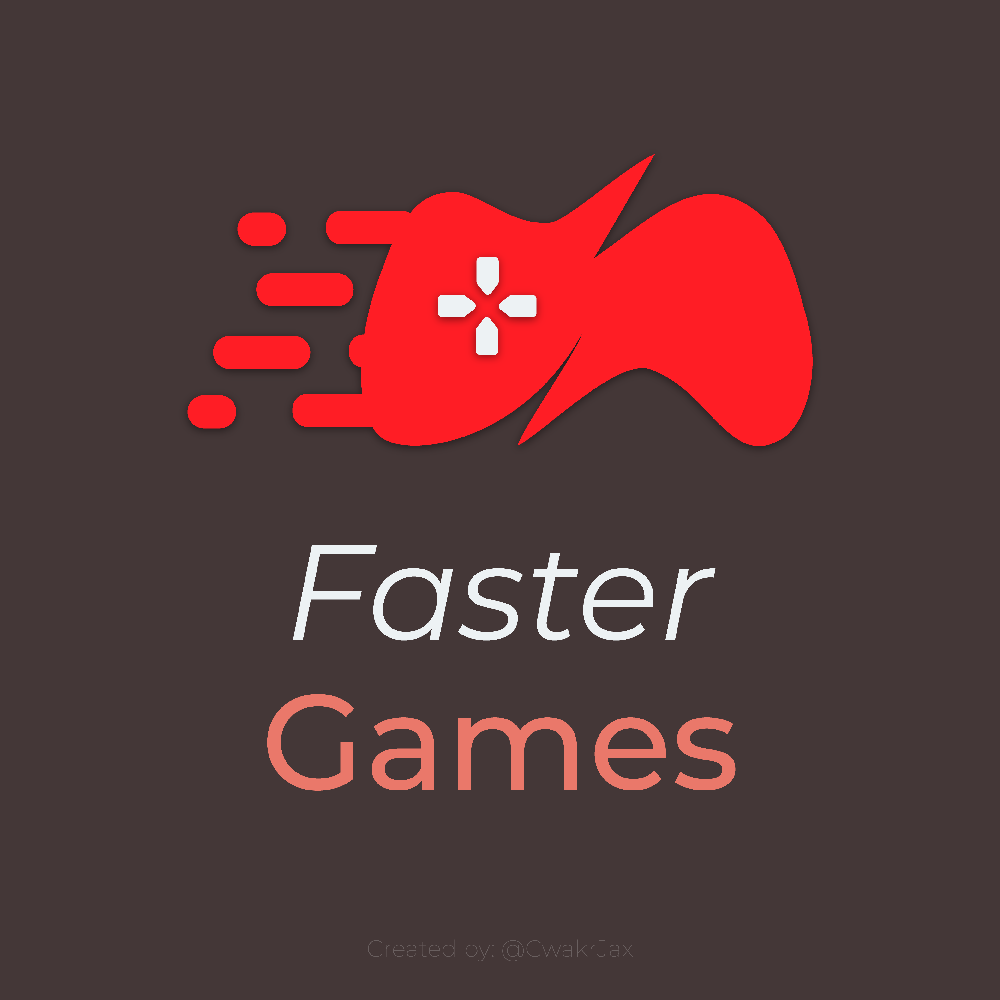

# RoR2 FasterGames Mod
> RoR2 Mod which reduces game times by speeding up progression in a variety of ways

This game is a blast, but in my opinion, it takes too much time to spin up. I don't have that much time in the day; thus FasterGames mod was created.

The mod tinkers with increasing a few attributes to make looting quicker while increasing the difficulty scaling to compensate. The result of this is fairly fantastic making God Runs only take 30 minutes with most runs ending around the 15 minute mark instead of the 45 minute mark.

Games should be about 2.5x-3x faster.

Make sure you select `Faster` difficulty before playing with this mod. All members of your party must have the mod installed.

## Game modifications
- Spawn rate adjusted to spawn smaller mobs
- Gain Exp Faster
- Gain Money Faster
- Increase base speed (For faster looting)
- Increase Difficulty Scaling
- Increase Chest Spawn Rates
- Increase Teleporter Charge Rate
- Overhauled Chance Shrine
	- 5 items
	- Scaling per use increased
	- No Cooldown
- Removes 3d printing cooldown

## Recommended Mods
`FasterGames.r2z` Added for my recommended mods to play with this mod.

## Todo
- Work on Balancing
	- Please add an issue with you recommended balance changes!
